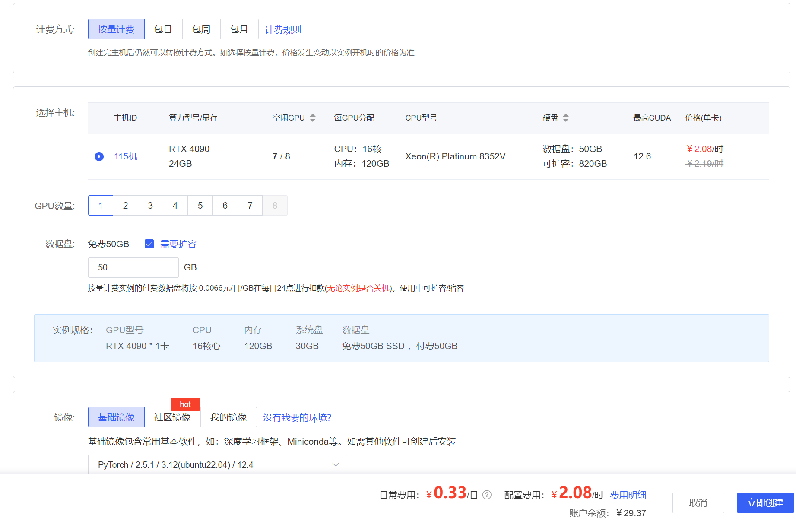
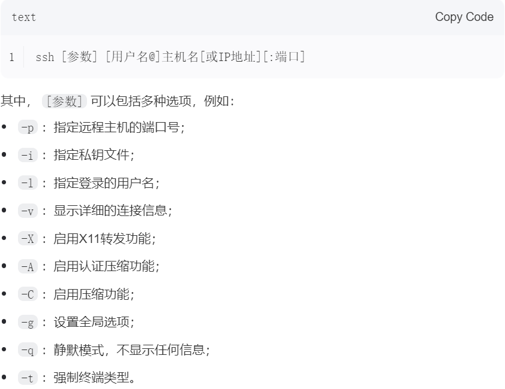
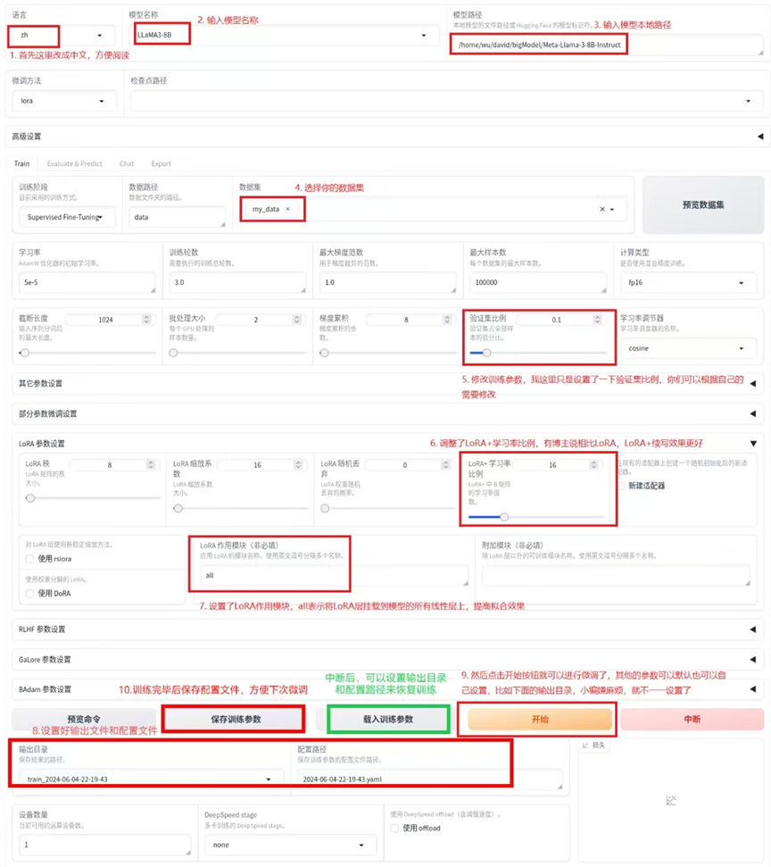
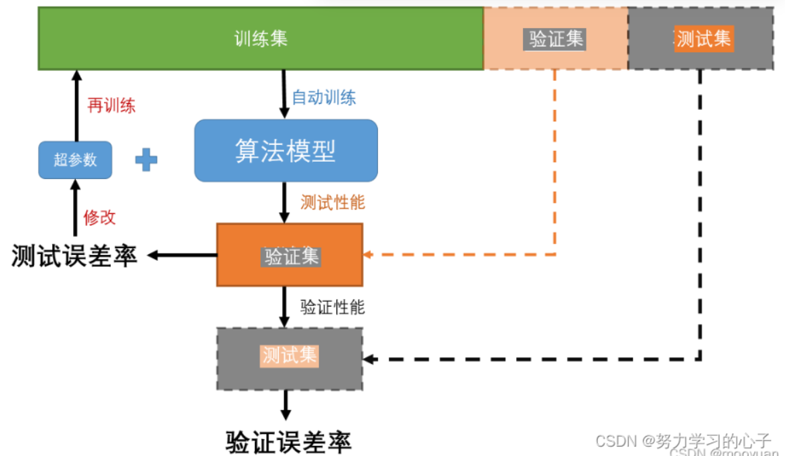

# 基于llama factory的大模型微调过程

### 省流

准备工作   →    租聘服务器   →    搭建并测试环境   →    上传文件   →    进行训练   →    检验结果   →    模型导出与本地部署     

---

### 简介

​	通用大模型虽然在许多领域发挥不错，但在某些特殊领域中仍然有待提高。在特殊领域的微调可以使通用大模型在该领域上的发挥更加出色（[专家系统](https://blog.csdn.net/weixin_51306394/article/details/140649350))。本文主要介绍从零开始微调大模型流程，附加大模型本地部署的流程。

​	大模型的参数非常多[^1]，即使只对部分参数进行训练，过程都非常的慢。所幸GPU并行计算能大大加速整个训练过程，所以整个训练过程基本是要绑定GPU(显卡)进行的[^2]。因此，GPU的性能也十分重要，不仅决定了训练的速度，还决定了训练能否正常进行[^3]。由于弄到高性能显卡的代价较高，而且使用时间也不会很长，笔者选择去算力平台[^4]上租聘服务器对大模型进行训练。价格都不贵，平均下来4090一小时也就2块钱，而且在准备阶段使用无卡模型开机，1毛钱1小时。

​	在租聘服务器过程中，平台根据用户的选择完成基础配置[^5]，但还需要自行进行一些其它的配置：准备llama factory、准备大模型、准备数据集。

​	在配置完成后，关机(如果之前是无卡模式)，并选择开机[^6]。[检测](https://blog.csdn.net/python12345678_/article/details/140346926)一下设备状况，如果有问题就对照着解决。接着，搭建ssh隧道[^7]，运行llama factory并在本地打开。

​	在llama factory中，可以进行大模型的训练与检验，教程网上很多，本文也会稍微介绍一些常用选项。

​	在训练好大模型后，==建议==通过克隆实例将数据备份，在备份文件中进行操作。

---

### 部分准备工作

​	先提前在本地准备好训练要用的数据集、模型[^8]。推荐下载一个文件传输软件如xftp、FileZilla等等，可以通过拖拽实现文件传输。如果只是测试，数据集和模型都不需要太大，只需要过一次流程即可，但与此相对应的是效果肯定不会很好。如果模型参数大于20b，后续可以考虑使用[COT](https://zhuanlan.zhihu.com/p/670907685)提升模型推理能力。在[中文大模型能力评测榜单](https://github.com/jeinlee1991/chinese-llm-benchmark)中，商用模型一般效果会比开源模型效果好，但对应的就是需要钱。在开源模型中，以5~20B模型排行为例，笔者推荐选用[phi-4](https://www.modelscope.cn/models/lmstudio-community/phi-4-GGUF/files)模型，性能好且以gguf格式存储，为后续的部署跳过了格式转换的麻烦。

​	数据集和模型在[hugging face](https://huggingface.co/)、[魔搭](www.modelscope.cn)等平台上都能弄到，hugging face是美国的平台，需要科学上网，而且申请模型时==不要填中国==，不然不给过的。hugging face在国内有[镜像平台](https://hf-mirror.com/)。魔搭是国内的平台，不需要科学上网，比较推荐。笔者是在服务器上先通过命令从魔搭下载模型，再通过校验检测文件缺失，然后在本地下载并上传，本文以Llama3-8B-Chinese-Chat模型为例，并使用自己准备的数据集进行微调。

---

### 租聘服务器

​	先选择好自己的算力平台[^4]，本文以autodl为例子进行演示。许多内容在[官方教程](https://www.autodl.com/docs/quick_start/)中都有讲述，强烈推荐先看一下(至少知道里面大概有什么内容)。==提醒：autodl有[学术加速](https://www.autodl.com/docs/network_turbo/)功能[^14]，开启后下载速度非常快。==

​	先进行注册，然后充一点钱，30块都够了。点击主页上方进入[算力市场](https://www.autodl.com/market/list)页面，根据需求选择自己想租用的服务器[^9]，选择镜像[^10]。基础镜像只包含一些常用的基本软件，如果要训练的模型在github上有项目，可以选用社区镜像。后续自己服务器的数据可以保存为"我的镜像"，可以理解为复制环境，可以安装(黏贴)在别的服务器中。



​	在购买好服务器后，进入控制台的[容器实例](https://www.autodl.com/console/instance/list)界面，开机[^11]。可以选择ssh登录，指令格式为：



​	但笔者更推荐直接点击快捷工具中的jupyterlab直接登录，很方便。另，快捷工具中的autopanel和实例监控两者是一样的。

---

### 搭建并测试环境

​	登录后，建议在autodl-tmp目录里进行操作，是服务器中的数据盘。先安装llama factory，请参考项目的[README](https://github.com/hiyouga/LLaMA-Factory?tab=readme-ov-file#dependence-installation)文档进行安装。

​	下载llama factory。如果装不上去，建议先在本地下载，然后上传到服务器。

~~~bash
git clone https://github.com/hiyouga/LLaMA-Factory.git  
~~~

​	配置环境，安装过程较久请等待：

~~~bash
conda create -n llama_factory python=3.10  
conda init
source ~/.bashrc
conda activate llama_factory  
cd LLaMA-Factory  
pip install -e .[metrics]
pip install -r requirements.txt
~~~

​	先做一个简单的正确性检验(==需先输入python==)：

~~~python
import torch  
torch.cuda.current_device()  
torch.cuda.get_device_name(0)  
torch.__version__
~~~

​	==注意，无卡模式会检测不到gpu导致报错。==

​	同时对本库的基础安装做一下校验，输入以下命令获取训练相关的参数指导, 否则说明库还没有安装成功。

~~~bash
llamafactory-cli train -h
~~~

​	模型下载(以”在魔搭下载llama-3-8B模型”为例)

~~~bash
git clone https://www.modelscope.cn/LLM-Research/Meta-Llama-3-8B-Instruct
~~~

​	下载后通常会出现文件缺失，需要输入du -sh *显示文件数量与大小，然后和官方的对比(一般是那几个大的文件丢失，也就是模型参数)。如有文件缺失，在本地下载缺失的文件并上传覆盖即可。

​	可以跑一下官方readme里提供的原始推理demo，验证模型文件的正确性和transformers库等软件的可用(需先输入python)：

~~~python
import transformers  
import torch  
  
# 切换为你下载的模型文件目录, 这里的demo是Llama-3-8B-Instruct  
# 如果是其他模型，比如qwen，chatglm，请使用其对应的官方demo  
model_id = "/media/codingma/LLM/llama3/Meta-Llama-3-8B-Instruct"  
  
pipeline = transformers.pipeline(  
    "text-generation",  
    model=model_id,  
    model_kwargs={"torch_dtype": torch.bfloat16},  
    device_map="auto",  
)  
  
messages = [  
    {"role": "system", "content": "You are a pirate chatbot who always responds in pirate speak!"},  
    {"role": "user", "content": "Who are you?"},  
]  
  
prompt = pipeline.tokenizer.apply_chat_template(  
        messages,  
        tokenize=False,  
        add_generation_prompt=True  
)  
  
terminators = [  
    pipeline.tokenizer.eos_token_id,  
    pipeline.tokenizer.convert_tokens_to_ids("<|eot_id|>")  
]  
  
outputs = pipeline(  
    prompt,  
    max_new_tokens=256,  
    eos_token_id=terminators,  
    do_sample=True,  
    temperature=0.6,  
    top_p=0.9,  
)  
print(outputs[0]["generated_text"][len(prompt):])
~~~

​	接着，在本地搭建ssh隧道。这是因为llama factory会提供一个WebUI界面，但这只是一个服务器的本地端口。ssh隧道可以让你可以在本地访问它。执行如下命令，使用 SSH 隧道将远程服务器的端口映射到本地端口：

~~~
[ssh登录指令] -L 7860:localhost:7860
~~~

​	其中，ssh登录指令可以直接在autodl复制，7860是llama factory的webui的默认接口，如果已经开了x个会变成7860+x。localhost可以通过在服务器上输入指令hostname -I来查看。==注意，localhost可能会变动==，如果不知为何连不上，可以输入hostname -I查看是否变动。

​	搭建好ssh隧道后，在服务器中输入llamafactory-cli webui[^12] ，它会返回一段URLhttp://0.0.0.0:7860，不用管它，在本地浏览器输入http://localhost:7860/就可以访问了（==可能需要有卡模式才可以正常运作==）。如果需要中断这个URL服务，在服务器中按ctrl+c即可。

​	==注意：目前webui版本只支持单机单卡，如果是多卡请使用命令行版本==

---

### 上传文件

​	笔者选择使用xftp进行文件传输，在xftp内通过ssh连接到服务器。然后将文件传入服务器中。数据集应该满足所需的基本框架，系统目前支持 alpaca 和sharegpt两种数据格式，以alpaca为例，整个数据集是一个json对象的list，具体数据格式为：

~~~json
[  
  {  
    "instruction": "用户指令（必填）",  
    "input": "用户输入（选填）",  
    "output": "模型回答（必填）",  
    "system": "系统提示词（选填）",  
    "history": [  
      ["第一轮指令（选填）", "第一轮回答（选填）"],  
      ["第二轮指令（选填）", "第二轮回答（选填）"]  
    ]  
  }  
]
~~~

此外，llama factory还自带了一些数据集，对应文件在data目录下，可以通过文本编辑器的替换功能替换其中的一些参数，如identity.json里的{{name}}和{{author}}。也可以参照自带数据集，更好地理解数据集的格式规范。

若想用我们自己的数据集进行训练，需要把该符合规范的json数据文件放在data目录下，并修改 data/dataset_info.json 新加内容完成注册, 该注册同时完成了3件事：指定名称，指定路径，定义原数据集的输入输出和我们所需要的格式之间的映射关系。做好这些后，就可以(==在工作路径中==)打开webui界面进行微调了。

---

### 进行训练

​	WebUI界面中有许多参数，可以后续再进行研究，这里只做一些必要的选项的介绍。

​	

​	首先左上角那个是语言选择，选择zh换成中文。旁边输入模型名称（即自己想用并已下载的模型），然后输入模型在服务器中的工作路径。接着，选择训练所需的数据集(点击右侧可预览)，若数据集较小就不要设验证集了。

​	接着来是训练的参数介绍，调整它们需要一些经验，所以只介绍一些简单的训练的参数：

- 学习率：在计算loss时，控制函数自变量的变化大小的参数。采用科学计数法表示，如果数据集小就调大一点点，总之要适当。

- 训练轮数：一轮会完整使用数据集中作为训练集的部分进行训练，但整个训练过程可能需要多轮。并不是说越大越好，还是要适当。

- 最大样本数：进行分批训练时，一个批次的数据的大小，如果显存放不下那么多数据，可以把这个参数调小。

- 验证集比例：对于监督学习来说，一般来说数据集可以分为训练集、测试集、验证集三个。具体查看[机器学习数据集----训练集、测试集以及验证集_训练集 测试集 验证集-CSDN博客](https://blog.csdn.net/weixin_58222015/article/details/128988588)

  

​	点击开始即可进行微调，当中断后，从config文件夹中找到相应的配置文件，并填写模型的检查点路径，然后载入训练参数就可以继续微调了。微调结果可以通过损失(loss)图初步判断，==损失如果在1以上那基本可以不用看，大概率失败了。==

​	除了在WebUI中点击开始，也可以通过手动命令进行训练。点击预览命令，并将其存在yaml文件中，然后用命令行执行yaml文件：

~~~bash
llamafactory-cli train [yaml文件绝对路径路径]
~~~

​	微调技术有许多，这里就不一一展开了。[教程1](https://blog.csdn.net/chengxuyuanyy/article/details/141320159)、[教程2](https://zhuanlan.zhihu.com/p/673789772)、[教程3](https://blog.csdn.net/SHIDACSDN/article/details/139933921)、[教程4](https://zhuanlan.zhihu.com/p/990958034)。

---

### 检验结果

​	在WebUI界面中，选择chat(之前的train是训练)可以加载模型与其对话，进行模型检验。可以通过对比训练前后的效果来判断模型能力是否提升，检查点路径这一项就是微调的参数。先问一些常识性的问题，比如1+1、天空为什么是蓝色、你是谁之类的问题，检测模型是否在训练后丧失了普通的对话能力；再问一些数据集里有的问题，检测模型的回答是否有提升，提升又如何。

​	除了用对话的方式检验，还可以选择Evaluate&Predict。llama factory提供了专门的评估方法进行模型评估，但结果需要一定知识才能看得明白，当然直接问ChatGPT评估结果是什么意思，效果好不好，也是可以的。

​	详细的检验方法可以参考[教程](https://zhuanlan.zhihu.com/p/18593955786)。

---

### 模型导出与本地部署

​	在WebUI界面中选择Export，然后填写导出路径即可。导出的本质是把基准模型和微调结果合并再输出，也是很大的。

​	官方声明：==运行7B的模型，RAM至少需要8GB显存==，那么更大的模型就更难部署了，需要看本地配置如何。

​	对于导出后的模型，虽然可以直接通过llama factory进行对话，但对于普通人员操控起来还是比较麻烦一点的。我们可以使用一些软件比如[LangChain](https://docs.langchain.com.cn/docs/introduction/)、[ollama](https://github.com/ollama/ollama)等对其进行管理。虽然笔者在网上收集了使用ollama导入模型的教程(见下文补充)，但在过程中遇到了问题[^13]，暂时没有解决。最终决定还是用llama factory进行本地部署。只需要稍微修改一下配置文件就行，但这必须要在本地支持gpu加速才能正常运行。

​	另，对于训练好的大模型，如果规模太大难以部署，可以尝试对它进行[模型压缩](https://blog.csdn.net/2401_86435672/article/details/142737928)。

---

### 一些改进的想法

1. 采用的模型参数较低，若想达到更高精度，需要选用更大的模型，到时候也可以使用[COT](https://zhuanlan.zhihu.com/p/670907685)进行推理能力的升级。（参数过少时用COT可能造成性能下降，详见超链接）
2. 可以尝试学一下[LangChain](https://blog.csdn.net/Y525698136/article/details/141253274 "大模型的管理")，它支持大模型与多种数据源的集成，包括数据库、API、文件系统。不过，据朋友所说，这玩意效果并没有吹的那么好，实际效果很一般。

---

### 补充：ollama使用(可能有误)

​	ollama安装与使用教程网上有许多教程，笔者看的有：[教程1](https://datawhalechina.github.io/handy-ollama/#/)、[教程2](https://github.com/ollama/ollama)、[教程3](https://blog.csdn.net/qq_42987058/article/details/144598371)。记得改模型存储位置([教程4](https://blog.csdn.net/youeyeb/article/details/144905333)、[教程5]((https://cloud.baidu.com/article/3368776)))，不然默认c盘。

​	ollama[导入模型](https://github.com/ollama/ollama/blob/main/docs/import.md)：由于Llama3-8B-Chinese-Chat的权重文件是以safetensors文件格式进行存储，而ollama需要权重文件以gguf格式存储[^15]，所以还需要安装llama.cpp进行[模型转化 ](https://blog.csdn.net/arkohut/article/details/140087605),[对应视频讲解](https://www.bilibili.com/video/BV1Mm42157HB)。==如果选用的模型的参数是以gguf格式存储的，则只需要编写modelfile文件即可。==

​	注意：

 	1. 教程里有些东西已经过时，如makefile已更新为cmake。
 	2. llama.cpp的环境与llama factory有冲突，建议用虚拟环境。

​	1. **先进行安装**

~~~bash
sudo apt-get update
sudo apt-get install cmake
git clone https://github.com/ggerganov/llama.cpp
~~~

​	2. **切换到项目目录并配置环境**: 还要确保你在项目的根目录中，有一个 `CMakeLists.txt` 文件。

~~~bash
cd llama.cpp
pip install -r requirements.txt
~~~

​	3. **创建构建目录并安装**: 推荐在项目目录外部创建一个单独的构建目录来进行构建。你可以在终端中运行以下命令(可能需要有卡模式)：

```bash
mkdir build
sudo apt-get install make cmake gcc g++ locate
cmake -B build -DGGML_CUDA=ON
cmake --build build --config Release -j4
cd build
make install
```

​	4. 在当前版本（截至2024年11月10日）这些指令分别被重命名为llama-quantize、llama-cli、llama-server，==注意替换路径==

~~~bash
ln -s your/path/to/llama.cpp/build/bin/llama-quantize llama-quantize
ln -s your/path/to/llama.cpp/build/bin/llama-server llama-server
ln -s your/path/to/llama.cpp/build/bin/llama-cli llama-cli
~~~

​	5. 将safetensors文件转为gguf文件

~~~bash
python convert-hf-to-gguf.py /your/path/to/models --outtype f16
~~~

​	转化好的模型会默认保存在 `/root/autodl-tmp/models` 目录下 `ggml-model-f16.gguf`。

​	6. 在下载ollama的机子（本地或服务器）撰写一个 `Modelfile` 文件，导入ollama中：

~~~bash
FROM /your/path/to/models/ggml-model-f16.gguf
ollama create arkohut/hermes-2-pro-llama-3-8b:fp16 -f Modelfile
~~~

​	注意，模型路径与名字可以改。

---

### 注释

[^1]: 8b参数也只算小型大模型了，但都要十几个G
[^2]: 笔者试过用cpu训练0.5b的微型大模型，跑了6个小时
[^3]: 显存爆了就会报错不跑了
[^4]: 笔者选择了[autodl](https://www.autodl.com/home)平台，还有[featurize](https://featurize.cn/)、[damodel](https://www.damodel.com/home)等等平台可以选择。若选择autodl平台，强烈建议先看一下[帮助文档](https://www.autodl.com/docs/quick_start/)
[^5]: 框架、python、cuda等等
[^6]: 有很大可能GPU会被其它用户占用，不要慌，克隆实例就行
[^7]: 用来将web接口在本地上打开
[^8]: 也可以在服务器上下载，不过很可能出现文件不完整，需要进行校验
[^9]: 如果模型、数据较大可在此扩容数据盘。另，建议选择租用空闲显卡多的服务器
[^10]: 可以理解为环境
[^11]: 如果想省点钱就先无卡模式开机，因为配环境不需要显卡。不过后续可能要额外操作
[^12]: 直接lla + Tab 然后webui就行
[^13]: ollama似乎只支持gguf形式的参数文件，而llama模型的参数权重以safetensors或bin存储。使用llama.cpp进行转换时不知为何会报错
[^14]: 但这个不稳定，有时候反而连不上，所以一般情况还是关着吧。如果在终端中使用：`source /etc/network_turbo`，**取消学术加速**:`unset http_proxy && unset https_proxy`
[^15]: 在近期更新后，官方文档里写着ollama似乎可以支持safetensors格式了，但我在实操的时候没有成功，所以暂时忽略。